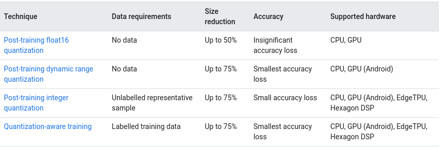
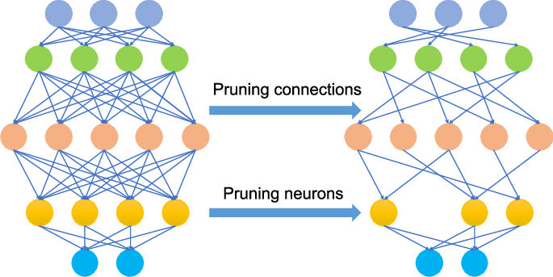
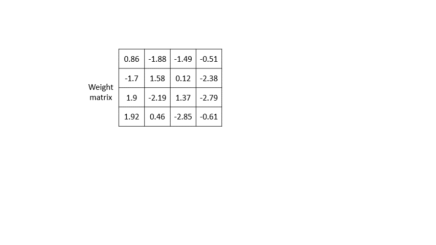

## Workshop on Deep Learning (develop to deploy for starters)

### Optimization: (TF Model Optimization Toolkit)

__Quantization: (Post or during training)__ 

*used to reduce the precision of the model’s parameters such as weights and activation outputs into 8-bit integers*. (default: `float32`)

_Improve latency, reduce model size with a little degradation in model accuracy_

* _Need less memory and network bandwidth,Int operation are less power hungry (Good for edge devices)_

* __Dynamic Range Quantization:__
  * _Simplest form (90% of cases)_
  * _Quantize only the weights from floating point to integer (8-bit)_
  * _Inference :_ weights converted from $8$-bit to float (done once and cached to reduce latency)
    * Mode __activation__ (also biases) outputs are always stored in floating-point 
    * Activation are quantized dynamically at inference
    * Perform computations with $8$-bit weights and activations.

* __Full Integer Quantization:__

  _For full integer quantization, you need to calibrate or estimate the range, i.e, (min, max) of all floating-point tensors in the model_

  * _Converter requires a representative dataset ( $\approx 100-500$ ) to calibrate activations and model output_

* __Float 16:__

  * _It reduces model size by up to half._
  * _It causes minimal loss in accuracy._
  * _Perfect for Nvidia Edge GPUs_

_Integer only: 16-bit activations with 8-bit weights (experimental) read more on [Tensorflow document](https://www.tensorflow.org/lite/performance/post_training_quantization#integer_only_16-bit_activations_with_8-bit_weights_experimental)_

__Pruning : (During training only)__

_But that does not mean you can't use it with pre-trained model (recommended approach)_

 

​				_Image source: Overview of Pruning Neural Networks using PyTorch | by Yaser Sakkaf_

__Weight Clustering :__

_For more info on how it works check [Tensorflow blog]()_

