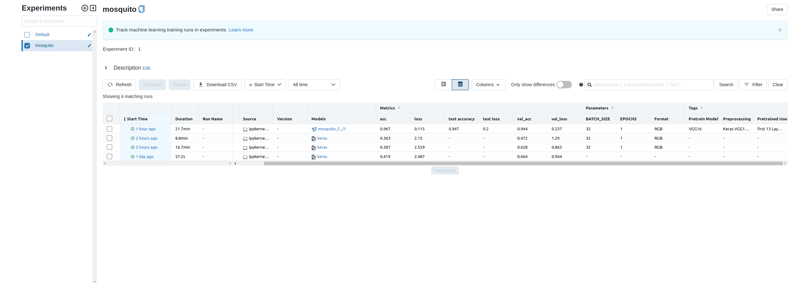

## Workshop on Deep Learning (develop to deploy for starters)

* _Switch between branches in order to see all developed versions of code_

The purpose of this online series is to develop an image classifier using  __[TensorFlow](https://www.tensorflow.org/)__ and __[Keras](https://keras.io/)__ on a funny dataset __[Mosquito-on-human-skin](https://data.mendeley.com/datasets/zw4p9kj6nt/2)__ we don't talk __MNIST__ here :D.

We will discuss why we need to log every single experiment and how to do it easily with __[MLflow](https://www.mlflow.org/)__ with 2-3 lines of code, and then we will use the advanced functions of MLflow to expand our knowledge.

Here are some questions we'll try to answer:

- *MLflow: what is it? (Components, configuration, storage options, etc.)*
- *Can you tell me why we need it? When and how do we use it?*
- *Can you tell me what the benefits are?*

_The next step is to deploy the model using either __MLflow Models__ or __Tensorflow Serving__, which are the two popular approaches._

*A hands-on experience with basic optimization steps will be provided to help us understand why and when we need optimization.*

*It would be nice if we had enough time to develop an __API__ (Application Programming Interface) using __[FastApi](https://fastapi.tiangolo.com/)__, and we would also need to use __[Docker](https://www.docker.com/)__ so that maintenance on production become as simple as possible.*

*What's next? Could it be __TFX__?*

__A basic understanding of deep learning and machine learning is required__